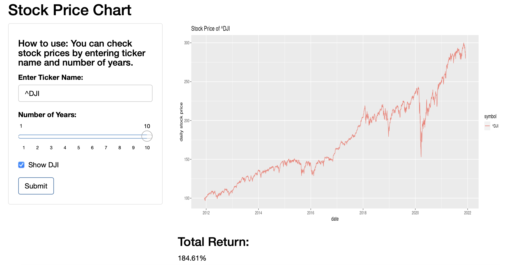
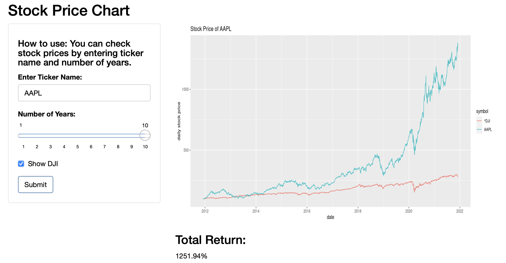

```{r setup, include=FALSE}
library(tidyverse)
library(tidyquant)
```

## Stock Price Chart Application

- This shiny application is to show stock price chart
- You can enter "Ticker Name" and "Number of Years"
- You can compare your stock with Dow Jones Industrial Average (DJI) index
- URL: https://t-miyazaki.shinyapps.io/Stock-Chart/
- R Code: https://github.com/t-miyazaki/Developing-Data-Products-Course-Project

## Sample Stock Price Chart

```{r stock price chart, echo=FALSE}
# loading data
ticker <- "GOOG"; years <- 1
end <- today(); start <- today() - dyears(years)
prices <- tq_get(ticker, from = start, to = end, get = "stock.prices") 

# plot stock price chart
g <- ggplot(prices, aes(x = date, y = adjusted))
g <- g + geom_line()
g <- g + labs(title = paste("Stock Price of", ticker),
              x = "date",
              y = "daily stock price")
g
```

## Example: Dow Jones Industrial Average

{width=100%}

## Example: Apple

{width=100%}
